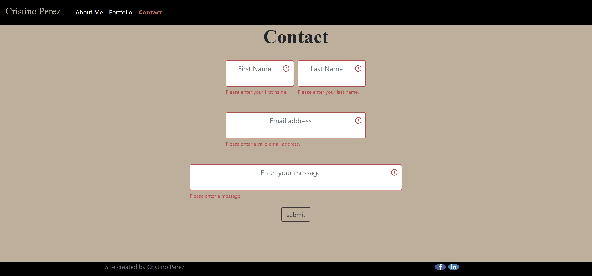

Responsive Portfolio by Cristino Perez (https://github.com/cperez525)

Project repo url: https://github.com/cperez525/Responsive_Portfolio

Deployed application URL: https://cperez525.github.io/Responsive_Portfolio/

Professional website with portfolio featuring project and other homework assignments.

This app was developed using HTML, CSS, and jQuery.

Screenshots:
1) About Me page- 
2) Portfolio page- 
3) Contact_page- 